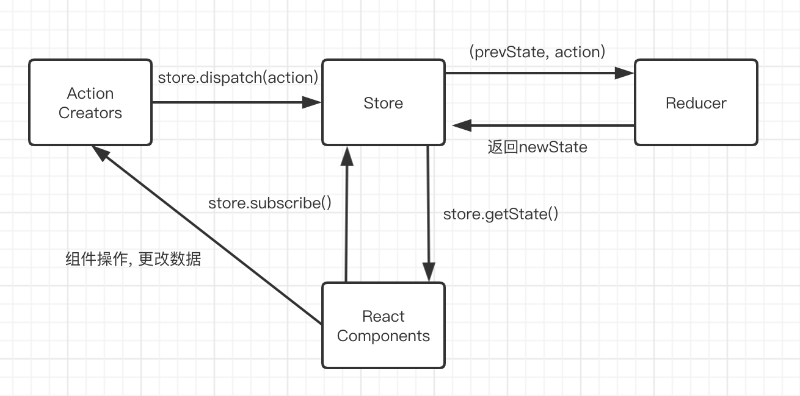
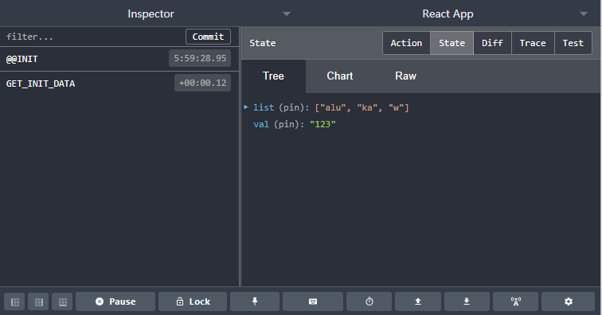

# Redux

## redux基本用法

1. `yarn add redux`

2. demo: redux-store

3. redux 流程图

    

4. redux 三大原则

   1. store 唯一
   2. store 只能由 store 更新, reducer 返回新的 state, store 接受, 然后自我更新
   3. reduce 必须纯函数

5. redux 常用 api

   1. store.subscribe(fn): 发布订阅, store 更改, 执行 fn
   2. store.getState(): 获取 store 数据
   3. store.dispatch(action): 派发 action 到 reducer, 然后更新 store 的值

## redux中间件

1. 原理: action 到 store 的中间, 升级 dispatch 方法

2. 例子: redux-saga, redux-thunk, redux-logger(在每次 dispatch 时, 打印)

### Redux DevTools Extension

1. 目的: 方便回溯数据的流向, redux 中间件

2. 使用:

   ```js
   // store - index.js
   import { createStore, applyMiddleware, compose } from 'redux'
   import reducer from './reducer'
   import thunk from 'redux-thunk'

   const composeEnhancers =
     typeof window === 'object' && window.__REDUX_DEVTOOLS_EXTENSION_COMPOSE__
       ? window.__REDUX_DEVTOOLS_EXTENSION_COMPOSE__({})
       : compose

   const enhancer = composeEnhancers(applyMiddleware(thunk))
   const Store = createStore(reducer, enhancer)
   ```

3. 图例

    

> DevTools 配置: `https://github.com/zalmoxisus/redux-devtools-extension`

### redux-thunk

1. 目的: 简单的处理异步请求, redux 中间件

2. 原理: redux-thunk, dispatch 检测到是函数, 先执行再派发, 给 reducer

3. 局限: 破坏了 reducer 处理纯函数的原则

4. 代码:

   ```js
   // actionCreator 直接返回函数
   export const getList = () => {
     return (dispatch) => {
       axios.get('/api/list.json').then((res) => {
         const data = res.data
         const action = initDataAction(data)
         dispatch(action)
       })
     }
   }
   ```

> redux-thunk: `https://github.com/reduxjs/redux-thunk`

### redux-saga

1. 目的: 处理异步请求, 适用于复杂大型的项目数据请求(复合 dispatch 纯函数)

2. 代码

   ```js
   // sagas.js
   import { put, takeEvery } from 'redux-saga/effects'
   import axios from 'axios'
   import { GET_INIT } from './actionTypes'
   import { initDataAction } from './actionCreator'

   // generator函数, 处理异步请求, try-catch处理错误请求
   function* fetchUser() {
     console.log('监听到了GET_INIT')
     try {
       const res = yield axios.get('/api/list.json')
       const action = initDataAction(res.data)
       yield put(action)
     } catch (e) {
       console.log('请求错误')
     }
   }

   // takeEvery, 监听GET_INIT动作, 有就执行fetchUser
   function* todoListSaga() {
     yield takeEvery(GET_INIT, fetchUser)
   }

   export default todoListSaga
   ```

   ```js
   // main.js
   import { createStore, applyMiddleware } from 'redux'
   import createSagaMiddleware from 'redux-saga'

   import reducer from './reducers'
   import mySaga from './sagas'

   // create the saga middleware
   const sagaMiddleware = createSagaMiddleware()
   // mount it on the Store
   const store = createStore(reducer, applyMiddleware(sagaMiddleware))

   // then run the saga
   sagaMiddleware.run(mySaga)
   ```

> redux-saga: `https://github.com/redux-saga/redux-saga`

## react-redux

